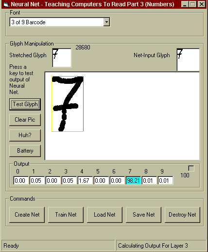



## Teaching Computers To Read Part 3

### Description

An Optical Character Recognition (OCR) program. The goal of this ongoing experimental project is to build a neural net capable of recognising zipcodes or text within bitmaps. Part 3 includes a much faster net (array based, rather than Class/Collection based), simulated annealing, and Nguyen-Widrow initialisation. Other keywords: AI, Artificial Intelligence, Perceptron, Feed-Forward, BackPropogation
 
### More Info
 

             |
---                |---
**Submitted On**   |2001-05-03 09:26:30
**By**             |[BigCalm](https://github.com/Planet-Source-Code/PSCIndex/blob/master/ByAuthor/bigcalm.md)
**Level**          |Advanced
**User Rating**    |4.9 (183 globes from 37 users)
**Compatibility**  |VB 5\.0, VB 6\.0
**Category**       |[Object Oriented Programming \(OOP\)](https://github.com/Planet-Source-Code/PSCIndex/blob/master/ByCategory/object-oriented-programming-oop__1-47.md)
**World**          |[Visual Basic](https://github.com/Planet-Source-Code/PSCIndex/blob/master/ByWorld/visual-basic.md)
**Archive File**   |[Teaching C19183542001\.zip](https://github.com/Planet-Source-Code/bigcalm-teaching-computers-to-read-part-3__1-22932/archive/master.zip)

